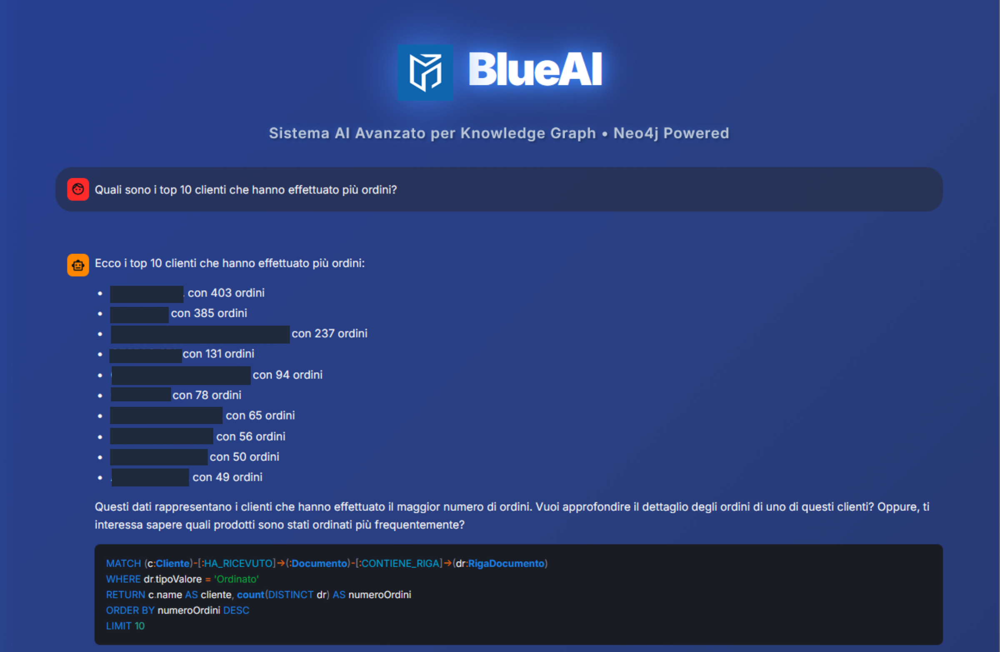
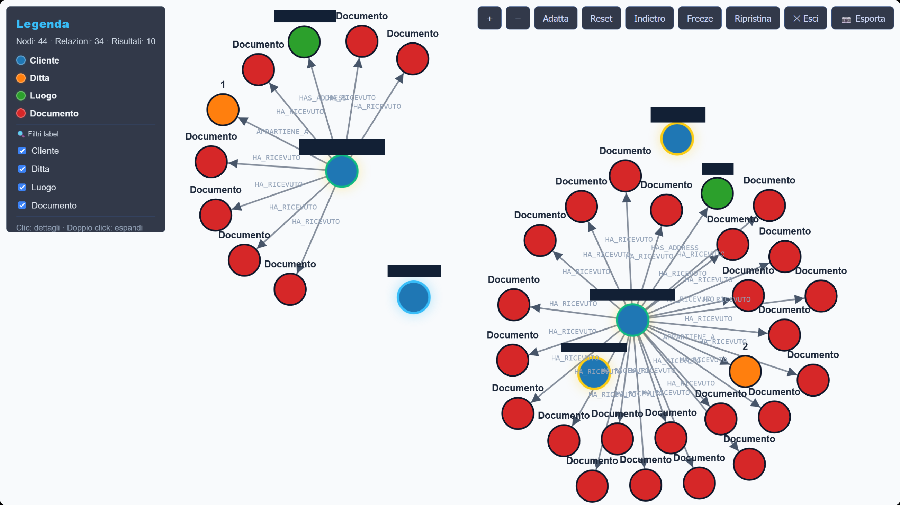
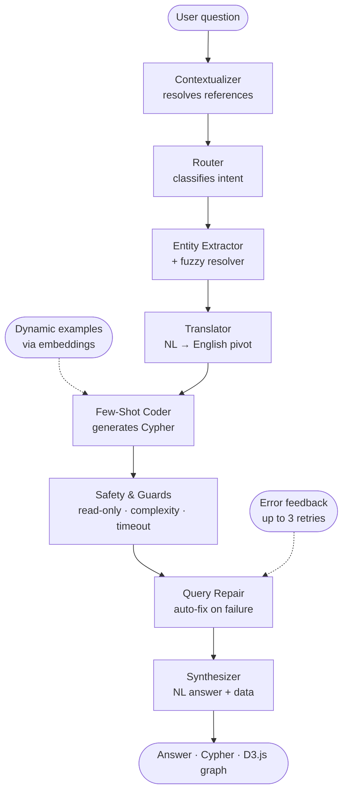

# BlueAI — Conversational ERP Intelligence

  
  
  
  
  
  
  

  <b>Master's Thesis Project · University of Perugia</b> 
  Built in collaboration with <b>Blue System Srl</b>

---

## The Problem

Enterprise ERP systems hold critical business data — sales, purchases, inventory, clients — but accessing it requires SQL expertise or pre-built reports. Non-technical users are locked out.

**BlueAI removes that barrier.**

Ask a question in plain language. Get an accurate, traceable answer grounded in your actual company data — with the generated query and the knowledge graph relationships shown transparently.

---

## Demo

  
   <em>Natural language query → real-time answer with auto-generated Cypher query</em>

  
   <em>Interactive subgraph view powered by D3.js — every answer is explainable</em>

---

## How It Works

BlueAI is built on three pillars.

### 1. Knowledge Graph (Neo4j)
ERP data is migrated from relational tables into a semantic graph through a custom ETL pipeline with ontological modeling. Entities like clients, documents, products, and suppliers become nodes with explicit, navigable relationships — making multi-hop queries natural and efficient.

### 2. Multi-Agent Pipeline (LangChain + FastAPI)
A request doesn't go through a single prompt. It flows through a sequence of specialized agents, each with a defined role and strict input/output contracts:

```mermaid
flowchart TD
    A([User question]) --> B[Contextualizer\nresolves references]
    B --> C[Router\nclassifies intent]
    C --> D[Entity Extractor\n+ fuzzy resolver]
    D --> E[Translator\nNL → English pivot]
    F([Dynamic examples\nvia embeddings]) -.-> G
    E --> G[Few-Shot Coder\ngenerates Cypher]
    G --> H[Safety & Guards\nread-only · complexity · timeout]
    H --> I[Query Repair\nauto-fix on failure]
    J([Error feedback\nup to 3 retries]) -.-> I
    I --> K[Synthesizer\nNL answer + data]
    K --> L([Answer · Cypher · D3.js graph])
```
### 3. Robustness by Design
BlueAI is built for production enterprise environments:

- **Read-only enforcement** — write operations are blocked at the guardrail level, no exceptions
- **Self-healing repair loop** — failed Cypher queries are automatically corrected using execution error feedback
- **Adaptive timeouts** — query complexity is estimated before execution; risky queries get safe rewrites
- **Semantic expansion** — terminology mismatches between user input and graph values are handled gracefully

---

## Dynamic Few-Shot Retrieval

Instead of hardcoding examples in prompts, the system retrieves them at runtime:

1. The user's question is embedded with `all-MiniLM-L6-v2`
2. Top-k most similar past (question → Cypher) pairs are fetched by cosine similarity
3. These examples are injected into the Coder's prompt, tailored to the current request

This stabilizes Cypher generation across models and query types — especially critical for open-source models that struggle without contextual guidance.

---

## Experimental Results

Validated on **106 real-world business questions** across 9 configurations (3 models × 3 values of k).

  

| Model | k=0 | k=2 | k=5 |
|---|---|---|---|
| GPT-4o | 84.9% | **92.5%** | 86.8% |
| Gemini 2.5 Flash | 61.3% | 83.0% | 80.2% |
| Llama3 8B *(coder only)* | 18.9% | 76.4% | 83.0% |

**Key findings:**
- GPT-4o at k=2 achieves **92.5% Strict Accuracy** at **6.65s** average end-to-end latency
- Dynamic few-shot takes Llama3 8B from 18.9% → 76.4% with just 2 examples (**+57.5 percentage points**)
- Neo4j is never the bottleneck — average DB latency **< 1.5s** across all configurations
- k=2 is the sweet spot: maximum accuracy, minimal prompt noise

---

## Tech Stack

| Layer | Technology |
|---|---|
| LLMs | GPT-4o, Gemini 2.5 Flash, Llama3 8B |
| Orchestration | LangChain, FastAPI |
| Knowledge Graph | Neo4j, Cypher |
| Embeddings | sentence-transformers/all-MiniLM-L6-v2 |
| Frontend | Streamlit, D3.js |
| ETL | Python, ODBC, Cypher MERGE/UNWIND |

---

## Project Context

BlueAI was designed, implemented, and validated during my **Master's thesis in Computer Science and Robotics Engineering** at the University of Perugia, developed in collaboration with **Blue System Srl** on real company data and infrastructure.

The project covers the full stack: data engineering (ontological modeling + ETL), system architecture (multi-agent pipeline), AI engineering (prompt design, few-shot retrieval, guardrails), and empirical evaluation.

> This is not a prototype built on synthetic data. It runs on a real ERP system, handles real business questions, and was validated on real results.

---

## Author

**Daniele Nanni Cirulli**  
MSc Computer Science and Robotics Engineering  
[LinkedIn](#) · [GitHub](#) · [Email](#)
