# 🤖 Enterprise ERP Assistant (GraphRAG)

> **Internship Project at Blue System Srl** > Democratizing access to complex ERP data through Natural Language Processing, Knowledge Graphs, and Multi-Agent Architectures.

---

## 🚀 Overview

This project implements an **Agentic Conversational Assistant** designed to query enterprise ERP databases (Sales, Purchases, Projects) using natural language.

Instead of relying on rigid SQL reporting, the system leverages a **Knowledge Graph (Neo4j)** and a **Proactive Multi-Agent Architecture** to translate user questions into precise Cypher queries (Text-to-Cypher).

**Key Goal:** Allow non-technical stakeholders to ask questions like *"What is the revenue for Client X in 2024?"* and receive real-time, accurate data without needing SQL knowledge.

---

## 🏗️ Architecture: The Multi-Agent System

The project evolved from a standard monolithic RAG approach to a robust **Multi-Agent System**.
Below is the logical flow of the system, where specialized agents collaborate to handle ambiguity and complex logic.

```mermaid
graph TD
    User([User Question]) --> Translator[🗣️ Translator Agent]
    Translator --> Router{🚦 Router Agent}
    
    subgraph "Understanding Phase"
    Router -- "Sales / Purchases" --> Extractor[ner Entity Extractor]
    Extractor --> Resolver[🔍 Entity Resolver & Logic Layer]
    end
    
    subgraph "Reasoning Phase"
    Resolver --> Retriever[📚 Dynamic Few-Shot Retrieval]
    Retriever --> Coder[💻 Coder Agent]
    Coder --> Cypher[Generates Cypher Query]
    end
    
    subgraph "Execution & Safety"
    Cypher --> Safety{🛡️ Safety Layer}
    Safety -- "Syntax Error" --> Repair[🔧 Repair Loop Agent]
    Repair -- "Fixed Query" --> Cypher
    Safety -- "Valid" --> Neo4j[(Neo4j Knowledge Graph)]
    end
    
    Neo4j --> Synthesizer[📝 Synthesizer Agent]
    Synthesizer --> UI[Final Answer + D3.js Viz]
```

## Key Components

    🕵️ **Entity Resolver & Logic Layer**: Handles domain-specific ambiguities (e.g., distinguishing "Rossi" the Client from "Rossi" the Supplier) using logic rules and fuzzy matching.

    🧠 **Dynamic Few-Shot Retrieval**: Instead of static examples, the system uses Embeddings (all-MiniLM-L6-v2) to fetch the top-k most similar past queries to guide the LLM contextually.

    🛡️ **Self-Healing Mechanism (Repair Loop)**: If the generated Cypher query fails (syntax error), the error is caught and fed back to a specialized agent that automatically fixes the code.

    🌐 **Interactive UI**: A Streamlit frontend integrated with D3.js to render interactive subgraphs, allowing users to visually explore the data relationships returned by the query.

## 📊 Performance & Results

We validated the architecture using a dataset of real-world business questions, comparing the initial Monolithic approach against the new Multi-Agent architecture.

## 🛠️ Tech Stack

    LLMs: Meta Llama 3 (Local Execution), Google Gemini (Benchmark).

    Orchestration: LangChain (Python).

    Database: Neo4j (Graph Database), Cypher Query Language.

    Backend: FastAPI.

    Frontend: Streamlit, Custom D3.js components.

    Embeddings: sentence-transformers/all-MiniLM-L6-v2.

## Demo Preview

(Placeholder for your screenshots. Upload images to an 'assets' folder and link them here)

## 👨‍💻 Author

Daniele Nanni Cirulli Computer Science Student & AI Developer
